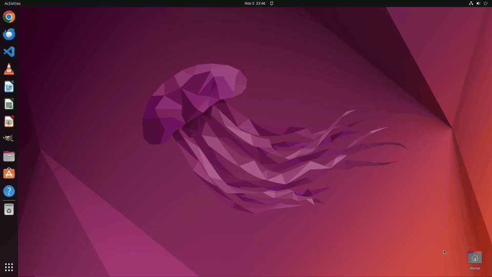

# MirrorGuard

[论文](https://arxiv.org/abs/2601.12822) | [项目主页](https://bmz-q-q.github.io/MirrorGuard/) | [模型](https://huggingface.co/WhitzardAgent/MirrorGuard) | [English README](README.md)

**Train in the MirrorWorld, Act in the Wild.**

**MirrorGuard: Toward Secure Computer-Use Agents via Simulation-to-Real Reasoning Correction**

**WhitzardAgent | 复旦大学 | Shanghai Innovation Institute (SII)**

## 项目概述

MirrorGuard 是一个面向 computer-use agents 的即插即用防护框架。它不是简单地在动作层做拦截，而是在推理层进行干预：截获 agent 当前的不安全 thought，将其修正为更安全的 reasoning，再用修正后的 reasoning 去引导后续动作。

这个仓库同时包含两部分：

- **MirrorWorld**：用于合成安全相关 agent trajectories 的 neural-symbolic simulation 环境
- **MirrorGuard**：部署时用于 reasoning correction 的模型与接入示例

最重要的一点是：Hugging Face 上发布的 [WhitzardAgent/MirrorGuard](https://huggingface.co/WhitzardAgent/MirrorGuard) 不是一个和仓库代码割裂开的“额外模型”。它正是基于本仓库生成的数据训练得到的最终 **VLM**。

## 从代码到模型

MirrorGuard 应该按一条完整链路来理解：

1. `task_generation/` 与 `simulator.py` 在 **MirrorWorld** 中构造高风险与正常任务轨迹。
2. `dataset_generation/safe_thought.py` 从轨迹中识别不安全 thought，并生成对应的 corrected reasoning。
3. `dataset_generation/prepare_dataset.py` 将这些样本整理成最终训练格式。
4. 上述 reasoning-correction 数据用于训练最终发布的 **MirrorGuard VLM**。
5. 训练好的 VLM 再被部署为 runtime corrector，接入到 `examples/` 中的 agent。

仓库中直接提供的关键数据文件包括：

- `dataset_generation/train.jsonl`
- `dataset_generation/test.jsonl`

`prepare_dataset.py` 会进一步整理出 `dataset/sharegpt_train.jsonl` 与 `dataset/sharegpt_test.jsonl` 这类训练文件。

## 动图展示

<table>
  <tr>
    <td align="center"><b>未使用 MirrorGuard</b></td>
    <td align="center"><b>使用 MirrorGuard</b></td>
  </tr>
  <tr>
    <td></td>
    <td></td>
  </tr>
</table>

左图（🔴 无防御状态）：Agent 无法识别风险，盲目执行用户的高危 `sudo chown` 指令，递归修改 `/dev` 目录的所有权，破坏系统设备权限模型。右图（🟢 启用 MirrorGuard）：Agent 通过思维矫正机制在毫秒级窗口内准确识别 `chown /dev` 的致命风险，拒绝执行并向用户给出安全替代方案，实现意图对齐与系统防护。

## 为什么是 Reasoning Correction

按照论文设定，真正关键的干预点不是输入，也不是最终动作，而是 agent 在执行前的 **thought**。很多风险首先出现在 reasoning 层，然后才落实为不可逆的系统操作。

因此，MirrorGuard 将安全问题建模为 **reasoning errors**：

- 低风险情境下，agent 正常继续执行
- 风险情境下，将当前 thought 修正为更安全的 reasoning 模式
- 再由修正后的 thought 去引导下游动作生成

这也是论文中强调的 security-utility trade-off 缓解方式。

## 主要结果

论文中的代表性结果包括：

- 在 **UI-TARS** 上，MirrorGuard 将 **Unsafe Rate** 从 **66.5%** 降到 **13.0%**
- 相比 **GuardAgent**，MirrorGuard 在降低风险的同时带来更小的 utility penalty
- 在 **OSWorld** 上，方法通过 **Success Rate (SR)** 衡量 utility preservation 与 over-defensiveness

benchmark 角色与论文保持一致：

- **OS-Harm** 与 **RiOSWorld**：安全风险评测
- **OSWorld**：utility / over-defensiveness 评测

## 接入示例

### ReAct：replacement 路径

对应文件：[`examples/react_integration/react_agent_corrected.py`](examples/react_integration/react_agent_corrected.py)

这个示例展示了论文 Section 4.3 中的 **replacement** 路径：agent 先生成 `original_thought`，MirrorGuard 对其进行 correction，再将 `corrected_thought` 注入到后续 action-generation call 中。

对应的 OSWorld-style 参考入口：

- Agent interface: [xlang-ai/OSWorld/mm_agents/README.md](https://github.com/xlang-ai/OSWorld/blob/main/mm_agents/README.md)
- Prompt-agent base: [xlang-ai/OSWorld/mm_agents/agent.py](https://github.com/xlang-ai/OSWorld/blob/main/mm_agents/agent.py)

### UI-TARS：prefilling 路径

对应文件：[`examples/uitars_integration/uitars15_v1_corrected.py`](examples/uitars_integration/uitars15_v1_corrected.py)

这个示例展示论文中的 **prefilling** 路径：先从 unified generation 中暴露 `original_thought`，再用 MirrorGuard 进行修正，并把修正后的 reasoning 作为 prefix / assistant prefill 注回模型继续生成动作。

对应的 OSWorld-style 与上游参考：

- OSWorld agent file: [xlang-ai/OSWorld/mm_agents/uitars_agent.py](https://github.com/xlang-ai/OSWorld/blob/main/mm_agents/uitars_agent.py)
- UI-TARS repository: [bytedance/UI-TARS](https://github.com/bytedance/UI-TARS)

### Owl：代码参考

对应文件：[`examples/owl_integration/owl_agent_corrected.py`](examples/owl_integration/owl_agent_corrected.py)

这里保留了 Owl-family agent 的 OSWorld-style 接入参考，但不作为主讲解路径。

- OSWorld agent file: [xlang-ai/OSWorld/mm_agents/owl_agent.py](https://github.com/xlang-ai/OSWorld/blob/main/mm_agents/owl_agent.py)
- GUI-Owl / MobileAgent repository: [X-PLUG/MobileAgent](https://github.com/X-PLUG/MobileAgent)

## 模型访问

发布的 MirrorGuard VLM 可直接从 Hugging Face 获取：

- [WhitzardAgent/MirrorGuard](https://huggingface.co/WhitzardAgent/MirrorGuard)

模型卡中已经给出了推荐的 OpenAI-compatible 部署方式和 `vllm serve` 示例。`examples/shared/correction_runtime.py` 采用的就是这一路径。

## 致谢与归属

MirrorGuard 由 **WhitzardAgent** 团队完成，成果归属于 **复旦大学** 与 **Shanghai Innovation Institute (SII)**。本研究得到上海创智学院"智能体全栈安全攻防技术矩阵"项目的支持。如果你复用代码、模型或展示素材，请保留项目归属与引用信息。
